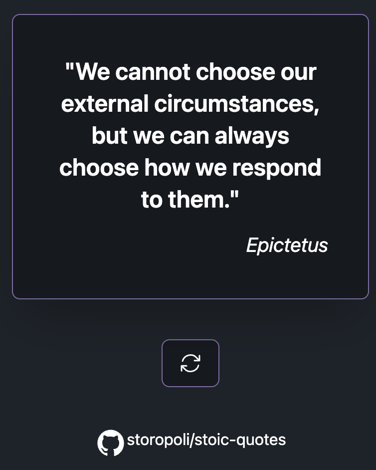

# Stoic Quotes

[](https://creativecommons.org/publicdomain/zero/1.0/)
[](https://opensource.org/license/mit/)

The whole app runs with [Rust](https://rust-lang.org) using
[htmx](https://htmx.org)[^yavascript] and plain HTML for "reactivity"[^note].

- [axum](https://tokio.rs/)
- [askama](https://djc.github.io/askama/)
- [htmx](https://htmx.org)
- [tailwindcss](https://tailwindcss.com/)
- [Satoshi Font](https://www.fontshare.com/fonts/satoshi)

<div align="center">
    
</div>

## Performance

This motherfucker is fast AF!

It only consumes 2.2mb of memory and the cheapest CPU VPS available will handle it.
The JSON data is loaded into memory (so that takes ≈0.2mb).
Leaving the whole app to consume 2mb of memory.

:heart: Rust!

## Terminal-ready

Yes, if you despise the bloated browsers and you prefer the warm embrace
of the terminal you can get your stoic quotes without leaving the terminal:

```bash
$ wget -qO- stoicquotes.io
"It is better to be despised for simplicity than to suffer agonies from everlasting pretense."
 - Seneca

$ curl stoicquotes.io
"It is better to be despised for simplicity than to suffer agonies from everlasting pretense."
 - Seneca
```

## License

This content is licensed under a
[Creative Commons Public Domain CC0 1.0 License](https://creativecommons.org/publicdomain/zero/1.0/).

The source code is licensed under a
[MIT License](https://opensource.org/license/mit/).

[](https://creativecommons.org/publicdomain/zero/1.0/)
[](https://opensource.org/license/mit/)

[^yavascript]: Look Mum! No YAVASCRIPT!
[^note]: [Hypermedia-Driven Applications](https://htmx.org/essays/hypermedia-driven-applications/)
